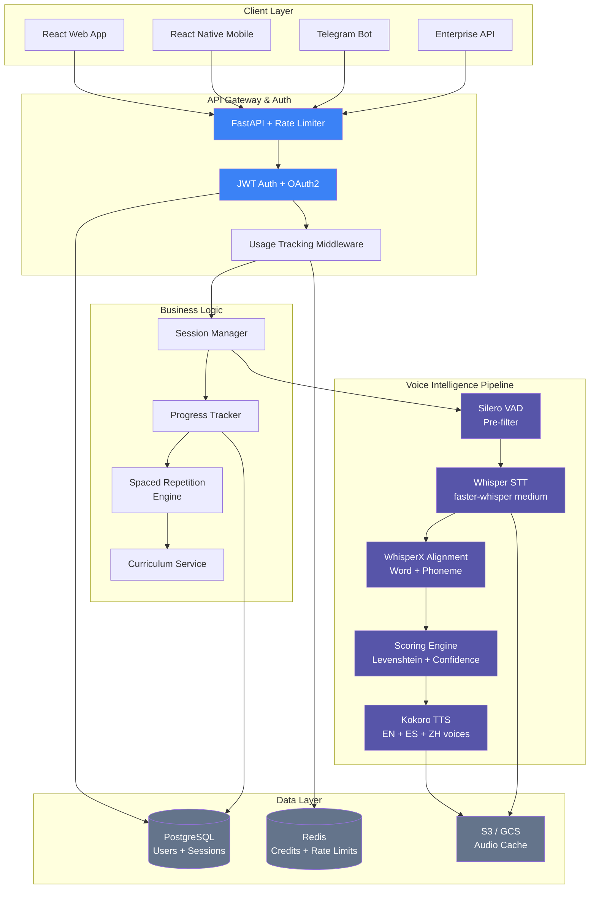
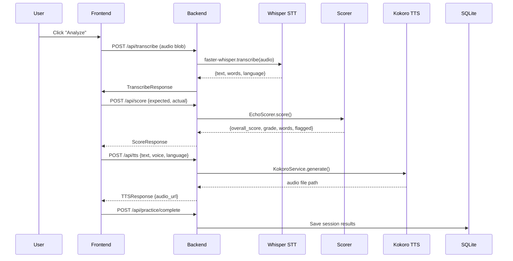
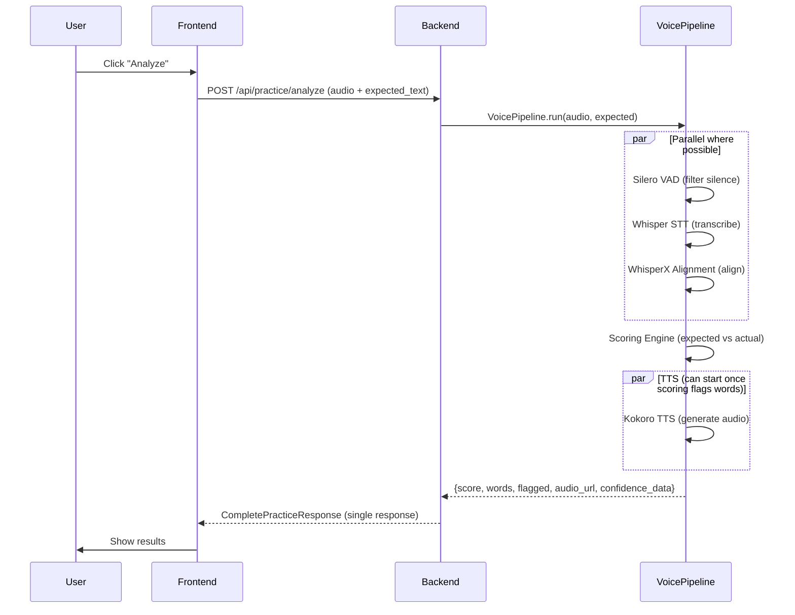
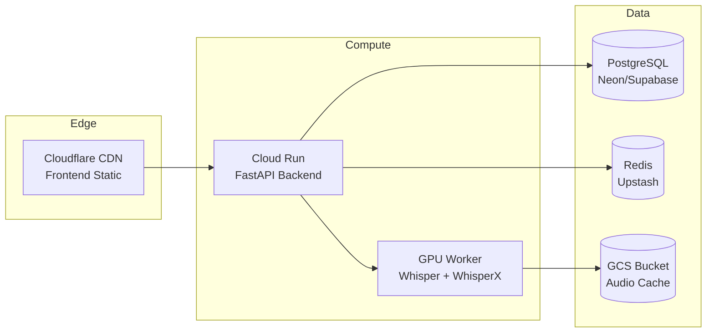

# Echo — Architecture & Product Roadmap

> Pronunciation intelligence platform | Built for the voice-first era  
> Last updated: 2026-05-08 | Status: **Phase 2 Complete — Pre-Scale**

---

## Table of Contents

1. [Product Vision](#1-product-vision)
2. [Current State Assessment](#2-current-state-assessment)
3. [Architecture Plan](#3-architecture-plan)
4. [Scoring Engine Deep Dive](#4-scoring-engine-deep-dive)
5. [Voice Pipeline Architecture](#5-voice-pipeline-architecture)
6. [Frontend Architecture](#6-frontend-architecture)
7. [Infrastructure & Deployment](#7-infrastructure--deployment)
8. [Product Roadmap](#8-product-roadmap)
9. [Technical Roadmap](#9-technical-roadmap)
10. [Gap Analysis & Action Items](#10-gap-analysis--action-items)
11. [Success Metrics & KPIs](#11-success-metrics--kpis)

---

## 1. Product Vision

**Echo** is a voice intelligence platform that transforms how people learn pronunciation. By combining real-time speech-to-text, phoneme-level alignment, and generative TTS feedback, Echo provides instant, granular coaching that was previously only available from human tutors.

### Why This Matters

The global language learning market is $15.6B and growing at 19.5% CAGR. Current solutions fall into two camps: proprietary black boxes (ELSA Speak, $32.5M revenue) that lock users into single-language silos, and generic chat bots that lack pronunciation expertise. Echo occupies the middle ground — open-voice-stack intelligence with per-phoneme precision across multiple languages.

### Core Differentiators

| Differentiator | How Echo Delivers | Why It's Hard to Copy |
|---|---|---|
| **Open voice stack** | faster-whisper + WhisperX + Kokoro TTS — fully auditable scoring | Competitors rely on proprietary models; Echo's transparency builds trust |
| **Multi-language from day one** | EN, ES, ZH with Kokoro voices for each | Most competing apps are English-only |
| **Phoneme-level feedback** | Tier 3 scoring via WhisperX alignment + DTW | Requires deep ASR alignment pipeline, not just text comparison |
| **Hybrid distribution** | Telegram bot, web app, mobile — same backend | Unique Telegram integration as zero-friction onboarding channel |
| **API-first** | Enterprise API for schools and call centers | B2B moat with per-seat licensing |

---

## 2. Current State Assessment

### What's Built (Working Code)

| Layer | Component | Status | File |
|---|---|---|---|
| **Backend** | FastAPI app with 7 endpoints | ✅ Working | `backend/main.py` |
| **Backend** | Pydantic models (8 schemas) | ✅ Working | `backend/models.py` |
| **Backend** | SQLite database with 4 tables + seeds | ✅ Working | `backend/database.py` |
| **Backend** | Whisper STT service (faster-whisper) | ✅ Working | `backend/whisper_service.py` |
| **Backend** | Kokoro TTS service (3 languages) | ✅ Working | `backend/kokoro_service.py` |
| **Backend** | Levenshtein scoring engine | ✅ Working | `backend/scoring.py` |
| **Backend** | Cloud Run deployment scripts | ✅ Working | `scripts/cloud-run-deploy.sh` |
| **Backend** | Dockerfile for Cloud Run | ✅ Working | `Dockerfile` |
| **Frontend** | Practice page with full flow | ✅ Working | `frontend/src/pages/PracticePage.tsx` |
| **Frontend** | Mic recorder with waveform | ✅ Working | `frontend/src/components/MicRecorder.tsx` |
| **Frontend** | Score display with color-coded feedback | ✅ Working | `frontend/src/components/ScoreDisplay.tsx` |
| **Frontend** | Sentence card component | ✅ Working | `frontend/src/components/SentenceCard.tsx` |
| **Frontend** | Sidebar navigation | ✅ Working | `frontend/src/components/Sidebar.tsx` |
| **Frontend** | Progress chart | ✅ Working | `frontend/src/components/ProgressChart.tsx` |
| **Frontend** | Microphone hook (MediaRecorder + WebAudio) | ✅ Working | `frontend/src/hooks/useMicrophone.ts` |
| **Frontend** | API client (7 endpoints) | ✅ Working | `frontend/src/services/api.ts` |
| **Frontend** | TypeScript types | ✅ Working | `frontend/src/types/index.ts` |

### What's Missing (Gaps)

| Gap | Priority | Impact | Effort |
|---|---|---|---|
| **No authentication** | P0 | Cannot track users or monetize | 3 days |
| **No test suite** | P0 | Cannot ship confidently | 3 days |
| **WhisperX alignment not wired** | P1 | Stuck at word-level scoring, no phoneme precision | 5 days |
| **No user settings** (language/level selectors) | P1 | Users stuck at A1 English | 2 days |
| **Hardcoded user ID** | P1 | Cannot distinguish users | 1 day |
| **No CI/CD** | P1 | No automated quality gate | 1 day |
| **SQLite not production-grade** | P2 | Cannot handle concurrent users | 3 days |
| **No audio format normalization** | P2 | Browser recordings may fail transcription | 2 days |
| **No rate limiting** | P2 | GPU inference is expensive, needs guardrails | 1 day |
| **No Telegram bot integration** | P2 | Unique distribution channel inactive | 3 days |
| **Empty assets directory** | P3 | No logos, icons, or landing page assets | 2 days |
| **No LICENSE file** | P3 | Legal ambiguity | 10 min |
| **No shared/schema.sql** | P3 | Schema only exists in Python code | 1 day |

---

## 3. Architecture Plan

### System Architecture (Target State)



### Architecture Principles

1. **Voice pipeline is the core IP** — VAD → STT → Alignment → Scoring → TTS is the value chain. Every architectural decision optimizes this pipeline's latency and accuracy.

2. **Stateless compute, stateful data** — Backend services don't hold state; sessions live in PostgreSQL, audio in object storage, rate limits in Redis.

3. **Progressive enhancement** — Tier 1 scoring (Levenshtein) works everywhere. Tier 2 (WhisperX confidence) adds phoneme hints when GPU is available. Tier 3 (DTW phoneme alignment) is the aspirational target.

4. **API-first** — Every feature is accessible via API, making B2B integration trivial.

---

## 4. Scoring Engine Deep Dive

### Current: Tier 1 — Word-Level Levenshtein

```python
# backend/scoring.py (IMPLEMENTED)
class EchoScorer:
    def score(self, expected: str, actual: str) -> Dict:
        # 1. Tokenize expected and actual into words
        # 2. Compare each word pair using Levenshtein ratio
        # 3. Classify: correct (≥0.85), partial (≥0.60), incorrect (<0.60)
        # 4. Return overall_score, grade, word-level feedback, flagged words
```

**Strengths**: Fast, deterministic, language-agnostic, 0 GPU overhead.  
**Weaknesses**: Cannot detect phoneme-level errors (e.g., "th" vs "s" reads as similar strings). Position-based comparison breaks with word reordering.

### Next: Tier 2 — WhisperX Alignment + Confidence

```python
# PLANNED: backend/alignment_service.py
class AlignmentService:
    async def align(self, audio_path: str, expected_text: str) -> dict:
        # 1. Run WhisperX forced alignment on audio
        # 2. Get per-word timestamps + confidence scores
        # 3. Align recognized words to expected words (sequence matcher)
        # 4. Combine Levenshtein distance + WhisperX confidence
        # 5. Return phoneme-level hints for low-confidence words
```

**What this adds**:  
- Per-word timing alignment (which word was spoken when)  
- Confidence scores from the ASR model (how sure Whisper is)  
- Detection of inserted/omitted words via alignment, not just position  
- Foundation for phoneme-level scoring in Tier 3

**Implementation notes**:  
- WhisperX requires `torch` + `faster-whisper` + alignment model per language  
- Alignment adds ~200ms latency per request on GPU  
- CPU fallback is possible but slow (~2s)  
- Cache alignment models on startup (one per supported language)

### Future: Tier 3 — Phoneme-Level DTW

```python
# PLANNED: backend/phoneme_service.py
class PhonemeService:
    async def score_phonemes(self, audio_path: str, expected: str) -> dict:
        # 1. Extract expected phonemes from text (using phonemizer/espeak)
        # 2. Extract actual phonemes from WhisperX alignment
        # 3. Align phoneme sequences via Dynamic Time Warping
        # 4. Score each phoneme pair (match, substitution, insertion, deletion)
        # 5. Return per-phoneme scores with IPA notation
```

This is the ELSA Speak–grade scoring that differentiates Echo from "just another language app."

---

## 5. Voice Pipeline Architecture

### Request Flow (Current)



**Problem**: 4 sequential HTTP calls. Each round-trip adds latency. Total: ~3-8 seconds for a single practice session (dominated by Whisper transcription at 2-5s and TTS generation at 1-3s).

### Optimized Pipeline (Target)



**Key optimization**: Merge into a single `/api/practice/analyze` endpoint that returns everything in one response. The frontend makes 1 call instead of 4.

### Audio Processing Pipeline

```
Browser Recording (Opus/WebM)
    ↓
Format Conversion (ffmpeg → WAV 16kHz mono)
    ↓
Silero VAD (filter silence, validate speech present)
    ↓
faster-whisper STT (transcribe with word timestamps)
    ↓
WhisperX Forced Alignment (word-level timing + confidence)
    ↓
Scoring Engine (Levenshtein + confidence fusion)
    ↓
Kokoro TTS (generate correct pronunciation audio)
    ↓
Response: {score, words, flagged, audio_url}
```

### Latency Budget (Target)

| Stage | Current | Target | Optimization |
|---|---|---|---|
| Audio upload | 0.5s | 0.3s | Compress with Opus before upload |
| Format conversion | 0.3s | 0.1s | Accept WAV natively or use WebCodecs |
| VAD filter | 0.1s | 0.1s | Already fast |
| Whisper STT | 2-5s | <2s | Use `base` model for speed, `medium` for accuracy |
| WhisperX alignment | N/A | 0.2s | Run after STT, cached alignment model |
| Scoring | <0.01s | <0.01s | Pure computation |
| TTS generation | 1-3s | 1-3s | Cache common sentences; stream audio |
| **Total** | **4-9s** | **<4s** | Merge pipeline + parallelize + cache |

---

## 6. Frontend Architecture

### Current Component Tree

```
App.tsx
├── Sidebar.tsx (navigation)
├── PracticePage.tsx (main flow)
│   ├── SentenceCard.tsx (target sentence display)
│   ├── MicRecorder.tsx (record + waveform)
│   └── ScoreDisplay.tsx (results + word feedback)
└── ProgressPage.tsx (stats dashboard)
    └── ProgressChart.tsx (Recharts graphs)
```

### Target Component Tree

```
App.tsx
├── Sidebar.tsx
│   └── UserMenu.tsx (auth status, settings)
├── PracticePage.tsx
│   ├── SentenceCard.tsx
│   ├── LevelLanguageSelector.tsx (A1-C2 + EN/ES/ZH)
│   ├── MicRecorder.tsx
│   │   └── WaveformVisualizer.tsx (extracted canvas logic)
│   ├── ScoreDisplay.tsx
│   │   ├── PhonemeBreakdown.tsx (Tier 3: per-phoneme feedback)
│   │   └── RetryButton.tsx (practice flagged words)
│   ├── TTSAudioPlayer.tsx (streamed pronunciation playback)
│   └── StreakIndicator.tsx (daily streak counter)
├── ProgressPage.tsx
│   ├── ProgressChart.tsx
│   ├── WordMasteryGrid.tsx (which words are mastered)
│   └── LevelProgression.tsx (CEFR level progress)
├── SettingsPage.tsx
│   ├── LanguageSelector.tsx
│   ├── VoiceSelector.tsx (af_heart, ef_dora, etc.)
│   └── AccountSettings.tsx
└── AuthProvider.tsx (context for user state)
```

### State Management Strategy

- **Server state** → TanStack Query (already in use)  
- **Auth state** → React Context + JWT (needs implementation)  
- **Audio state** → `useMicrophone` hook (already in use, needs cleanup)  
- **Settings** → LocalStorage + server sync  

### Key Frontend Gaps to Fix

1. **Audio format normalization** — Browser `MediaRecorder` outputs WebM/Opus; Whisper needs WAV. Add server-side ffmpeg conversion or use `AudioContext.encodeIntoWAV()` on the client.

2. **Error boundaries** — No `ErrorBoundary` components. GPU inference failures (Whisper OOM, TTS timeout) will crash the app silently.

3. **Loading states** — PracticePage shows a spinner but no skeleton states or optimistic updates.

4. **Offline resilience** — No service worker or offline detection. If the backend is cold-starting on Cloud Run (30-90s), the user sees a hanging request.

---

## 7. Infrastructure & Deployment

### Current Deployment

```
Frontend → Netlify (static build)
Backend  → Cloud Run (Dockerfile)
Database → SQLite (ephemeral — lost on redeploy)
Audio    → Local filesystem (lost on redeploy)
```

### Target Deployment



### Migration Plan: SQLite → PostgreSQL

| Step | What | Why |
|---|---|---|
| 1 | Add SQLAlchemy async engine | Current database.py uses raw `sqlite3`; migrate to async `asyncpg` |
| 2 | Add Alembic migrations | Version-controlled schema changes |
| 3 | Add `DATABASE_URL` env var | Support both SQLite (dev) and Postgres (prod) |
| 4 | Seed script | Move sentence library from hardcoded to migration |
| 5 | Audio storage → GCS | Audio files can't live on ephemeral Cloud Run filesystem |

### Environment Configuration

```bash
# Core
DATABASE_URL=postgresql://...     # Postgres connection (prod) or sqlite:///echo.db (dev)
REDIS_URL=redis://...             # Rate limiting + credit tracking
GCS_BUCKET=echo-audio-prod        # Audio file storage
SECRET_KEY=<jwt-secret>            # Auth token signing

# Voice Pipeline
WHISPER_MODEL_SIZE=medium          # base (fast) | small | medium (accurate)
WHISPER_DEVICE=cuda                # cuda | cpu
KOKORO_CACHE_DIR=/app/models       # Cache downloaded models

# Features
ENABLE_WHISPERX=true               # Toggle Tier 2 alignment
ENABLE_RATE_LIMIT=true             # Free tier: 5 sessions/day

# CORS
ECHO_CORS_ORIGINS=https://echo.app,https://staging.echo.app
```

---

## 8. Product Roadmap

### Phase 1: Foundation (Weeks 1-2) — *Ship what works, make it solid*

**Goal**: Make the current Phase 2 web app production-ready for beta testers.

| Task | Description | Priority | Effort |
|---|---|---|---|
| **Auth system** | JWT authentication, signup/login, user context | P0 | 3 days |
| **End-to-end testing** | Test full flow: record → transcribe → score → TTS | P0 | 2 days |
| **Audio pipeline fix** | Browser WebM → WAV conversion (ffmpeg subprocess) | P0 | 1 day |
| **Settings page** | Language + level selectors (A1-C2, EN/ES/ZH) | P1 | 2 days |
| **Error handling** | Frontend error boundaries + backend error responses | P1 | 1 day |
| **SQLite → PostgreSQL** | Migrate to asyncpg + Alembic for production | P1 | 3 days |
| **Rate limiting** | Redis-based session limits (5/day free, 30/day pro) | P1 | 1 day |
| **Health monitoring** | `/health` endpoint + GPU status check | P2 | 0.5 days |
| **LICENSE file** | Add MIT license | P3 | 10 min |
| **CI/CD** | GitHub Actions: lint, test, build, deploy | P1 | 1 day |

### Phase 2: Voice Intelligence (Weeks 3-5) — *Deepen the core product*

**Goal**: Upgrade scoring from word-level to phoneme-level. This is what makes Echo competitive with ELSA Speak.

| Task | Description | Priority | Effort |
|---|---|---|---|
| **WhisperX integration** | Forced alignment service, per-word confidence scores | P0 | 5 days |
| **Merged pipeline endpoint** | Single `/api/practice/analyze` endpoint | P0 | 2 days |
| **Confidence-weighted scoring** | Fuse Levenshtein + WhisperX confidence | P0 | 2 days |
| **TTS caching** | Cache generated audio by sentence hash | P1 | 1 day |
| **Streaming TTS** | Stream Kokoro audio chunks to frontend | P2 | 3 days |
| **Word-level audio** | Generate TTS for individual flagged words | P1 | 1 day |
| **Progress dashboard v2** | Word mastery grid, level progression, streak tracker | P1 | 3 days |
| **Spaced repetition** | Prioritize words the user struggles with | P2 | 3 days |
| **Curriculum expansion** | Grow sentence library from 25 to 500+ sentences | P1 | 2 days |

### Phase 3: Scale & Monetize (Weeks 6-8) — *Make it a business*

**Goal**: Stripe payments, user accounts, free/pay walls, and the Telegram distribution channel.

| Task | Description | Priority | Effort |
|---|---|---|---|
| **Stripe integration** | Subscription tiers, checkout, webhooks | P0 | 5 days |
| **User accounts** | Email signup, OAuth (Google), profile management | P0 | 3 days |
| **Credit system** | Track practice sessions against daily limits | P0 | 2 days |
| **Telegram bot** | `/practice` command via Metis infrastructure | P1 | 3 days |
| **Admin dashboard** | User stats, revenue, system health | P1 | 3 days |
| **Landing page** | Marketing site with value prop + demo | P0 | 2 days |
| **Referral system** | Generate invite codes, track conversions | P2 | 2 days |

### Phase 4: Mobile & Advanced (Weeks 9-12) — *Go native*

**Goal**: React Native mobile app, phoneme scoring (Tier 3), and offline mode.

| Task | Description | Priority | Effort |
|---|---|---|---|
| **React Native scaffold** | Expo + shared API client | P0 | 3 days |
| **Audio recording** | Expo AV API for mic input | P0 | 2 days |
| **Offline mode** | Cache sentences + TTS audio for airplane practice | P1 | 3 days |
| **Push notifications** | Daily reminders, streak alerts | P1 | 2 days |
| **Phoneme scoring (Tier 3)** | DTW alignment of phoneme sequences | P1 | 5 days |
| **IP phoneme extraction** | espeak-ng → IPA conversion pipeline | P1 | 3 days |
| **Per-phoneme visualization** | Highlight specific sounds (e.g., /θ/ in "think") | P2 | 3 days |
| **App Store submission** | Screenshots, privacy policy, review prep | P1 | 3 days |

---

## 9. Technical Roadmap

### Architecture Decisions Log

| Decision | Choice | Rationale | Revisit If |
|---|---|---|---|
| **Database** | SQLite → PostgreSQL | SQLite for dev speed; Postgres for production concurrency | SQLite hits write lock contention at >10 concurrent users |
| **STT Engine** | faster-whisper | Best open-source transcription; supports word timestamps; GPU-accelerated | Need streaming STT (consider Whisper.cpp or assemblyai) |
| **TTS Engine** | Kokoro (local) | Free, multi-language, good quality; no API dependency | Latency too high (>3s); consider ElevenLabs API or cloud TTS |
| **Scoring** | Levenshtein → WhisperX → DTW | Progressive enhancement; Tier 1 works everywhere | Tier 3 phoneme scoring becomes critical differentiator |
| **Frontend** | React + Vite + TanStack Query | Already built; fast dev; good DX | Mobile requires React Native (shared logic) |
| **Mobile** | React Native + Expo | 80% code reuse from web; single team; EAS Build for stores | Performance issues on low-end devices |
| **Deployment** | Cloud Run (backend) + Netlify (frontend) | Auto-scaling; pay-per-use; already working | GPU cold starts too slow (>60s); consider dedicated GPU VM |
| **Auth** | JWT + OAuth2 (Google) | Simple, stateless, works across web/mobile/Telegram | Need enterprise SSO; add SAML/OIDC layer |

### API Versioning Strategy

All endpoints prefixed with `/api/v1/`. Breaking changes get a new version. Current endpoints are `/api/` (implicit v1). Migration path:

```
/api/transcribe        → /api/v1/transcribe
/api/score             → /api/v1/score
/api/tts               → /api/v1/tts
/api/practice/start    → /api/v1/practice/start
/api/practice/complete → /api/v1/practice/complete
/api/progress/{id}     → /api/v1/progress/{id}
/api/sentences         → /api/v1/sentences

# New merged endpoint:
/api/v1/practice/analyze  (audio + expected in single request)
```

### Database Migration Plan

```sql
-- v1: Current schema (SQLite)
-- Already exists in database.py

-- v2: Add user auth and credits
CREATE TABLE users (
    id UUID PRIMARY KEY DEFAULT gen_random_uuid(),
    email VARCHAR(255) UNIQUE,
    password_hash VARCHAR(255),
    telegram_id VARCHAR(50),
    tier VARCHAR(20) DEFAULT 'free',
    created_at TIMESTAMPTZ DEFAULT NOW(),
    last_active TIMESTAMPTZ
);

CREATE TABLE credit_balances (
    user_id UUID PRIMARY KEY REFERENCES users(id),
    balance INTEGER DEFAULT 5,
    daily_limit INTEGER DEFAULT 5,
    last_refresh DATE DEFAULT CURRENT_DATE
);

-- v3: Add word-level stats
CREATE TABLE user_word_stats (
    id UUID PRIMARY KEY DEFAULT gen_random_uuid(),
    user_id UUID REFERENCES users(id),
    word VARCHAR(100),
    language VARCHAR(5) DEFAULT 'en',
    times_attempted INTEGER DEFAULT 0,
    times_correct INTEGER DEFAULT 0,
    last_attempted TIMESTAMPTZ
);

-- v4: Add phoneme-level stats (for Tier 3)
CREATE TABLE user_phoneme_stats (
    id UUID PRIMARY KEY DEFAULT gen_random_uuid(),
    user_id UUID REFERENCES users(id),
    phoneme VARCHAR(20),  -- IPA notation
    language VARCHAR(5) DEFAULT 'en',
    times_attempted INTEGER DEFAULT 0,
    times_correct INTEGER DEFAULT 0,
    last_attempted TIMESTAMPTZ
);
```

---

## 10. Gap Analysis & Action Items

### Immediate (This Week)

- [ ] **Add LICENSE file** — MIT, matches badge in README
- [ ] **Fix audio format conversion** — Add ffmpeg WebM→WAV conversion in backend
- [ ] **Remove hardcoded user ID** — Add anonymous UUID generation at minimum
- [ ] **Add rate limiting middleware** — Prevent abuse of GPU inference
- [ ] **Add error boundaries** — Frontend `ErrorBoundary` around practice flow
- [ ] **Add backend tests** — At minimum: `test_scoring.py`, `test_api.py`

### Short Term (Next 2 Weeks)

- [ ] **JWT authentication** — Signup, login, protected endpoints
- [ ] **Settings page** — Language and level selectors
- [ ] **Streaming audio response** — Don't wait for full TTS generation; stream WAV chunks
- [ ] **Merged pipeline endpoint** — `/api/v1/practice/analyze`
- [ ] **CI/CD pipeline** — GitHub Actions: lint, typecheck, test, deploy to Cloud Run
- [ ] **Audio file storage → GCS** — Don't lose TTS cache on Cloud Run redeploy

### Medium Term (Month 2)

- [ ] **WhisperX integration** — Per-word confidence, forced alignment
- [ ] **Sentence library expansion** — 100+ sentences per language per level
- [ ] **Stripe integration** — Subscription tiers, checkout, webhooks
- [ ] **Telegram bot** — `/practice` command via Metis LangGraph route
- [ ] **PostgreSQL migration** — Neon or Supabase for production DB

### Long Term (Months 3-6)

- [ ] **Phoneme scoring (Tier 3)** — DTW alignment, per-phoneme feedback
- [ ] **React Native app** — Expo scaffold, shared API types
- [ ] **Offline mode** — Cache sentences + TTS, sync on reconnect
- [ ] **Admin dashboard** — User management, revenue, system health
- [ ] **Enterprise API** — Public docs (OpenAPI), rate-limited, B2B access

---

## 11. Success Metrics & KPIs

### Technical KPIs

| Metric | Current | Target (3 months) | Target (6 months) |
|---|---|---|---|
| **Practice latency** (record → result) | 4-9s | <4s | <3s |
| **Test coverage** | 0% | 60% | 80% |
| **Scoring accuracy** (vs human) | ~80% | 85% | 92% |
| **Uptime** | Unknown | 99.5% | 99.9% |
| **Cold start** | 30-90s | <15s | <5s |
| **Supported languages** | EN, ES, ZH | EN, ES, ZH | + FR, DE, JA, KO |

### Product KPIs

| Metric | Current | Target (3 months) | Target (6 months) |
|---|---|---|---|
| **Registered users** | 0 (no auth) | 500 | 5,000 |
| **Daily active users** | 0 | 100 | 1,000 |
| **Sessions per active user/week** | N/A | 5 | 7 |
| **Free → Pro conversion** | N/A | 8% | 12% |
| **Day-7 retention** | N/A | 30% | 45% |
| **Net Promoter Score** | N/A | >40 | >55 |

### Business KPIs

| Metric | Current | Target (3 months) | Target (6 months) |
|---|---|---|---|
| **MRR** | $0 | $500 | $5,000 |
| **Paid users** | 0 | 50 | 500 |
| **B2B accounts** | 0 | 2 pilots | 10 contracts |
| **Cost per session** | ~$0.02 (GPU) | $0.015 (cache optimization) | $0.01 (GPU sharing) |
| **LTV/CAC ratio** | N/A | >3:1 | >5:1 |

---

## Appendix A: Technology Stack Reference

| Layer | Technology | Version | Purpose |
|---|---|---|---|
| Backend | FastAPI | 0.115+ | Async API framework |
| Database | PostgreSQL | 16+ | Production data store |
| Database | SQLite | 3+ | Development data store |
| ORM | SQLAlchemy | 2.0+ | Async database access |
| Migrations | Alembic | 1.13+ | Schema versioning |
| Auth | python-jose + bcrypt | — | JWT + password hashing |
| STT | faster-whisper | 1.1+ | Speech-to-text transcription |
| Alignment | WhisperX | 3.3+ | Word-level forced alignment |
| TTS | Kokoro | 0.9+ | Text-to-speech synthesis |
| Scoring | python-Levenshtein | 0.26+ | Word comparison |
| VAD | Silero VAD | 5.1+ | Voice activity detection |
| Frontend | React | 19+ | UI framework |
| Frontend | TypeScript | 5.7+ | Type safety |
| Frontend | TanStack Query | 5+ | Server state management |
| Frontend | Vite | 6+ | Build tool |
| Frontend | Tailwind CSS | 4+ | Styling |
| Charts | Recharts | 2.15+ | Progress visualization |
| Mobile | React Native + Expo | — | Mobile app (Phase 4) |
| Payments | Stripe | — | Subscription billing |
| Deployment | Google Cloud Run | — | Backend hosting |
| Deployment | Netlify | — | Frontend hosting |
| Storage | Google Cloud Storage | — | Audio file cache |
| Cache | Redis (Upstash) | — | Rate limiting + credits |

## Appendix B: File Map

```
Echo/
├── backend/
│   ├── main.py                    # FastAPI app, all endpoints (247 lines)
│   ├── models.py                  # 8 Pydantic schemas (88 lines)
│   ├── database.py                # SQLite manager + seed data (279 lines)
│   ├── whisper_service.py         # faster-whisper STT wrapper (116 lines)
│   ├── scoring.py                 # Levenshtein scoring engine (109 lines)
│   ├── kokoro_service.py          # Kokoro TTS for EN/ES/ZH (115 lines)
│   └── requirements.txt           # 17 Python dependencies
├── frontend/
│   ├── src/
│   │   ├── App.tsx                # Router + layout (47 lines)
│   │   ├── main.tsx              # Entry point
│   │   ├── index.css             # Custom CSS (Tailwind v4 workaround)
│   │   ├── components/
│   │   │   ├── MicRecorder.tsx    # Mic recording + waveform (117 lines)
│   │   │   ├── ScoreDisplay.tsx   # Color-coded word feedback (174 lines)
│   │   │   ├── SentenceCard.tsx   # Target sentence display
│   │   │   ├── ProgressChart.tsx  # Recharts progress graphs
│   │   │   └── Sidebar.tsx        # Navigation layout
│   │   ├── hooks/
│   │   │   └── useMicrophone.ts   # MediaRecorder + WebAudio (156 lines)
│   │   ├── pages/
│   │   │   ├── PracticePage.tsx   # Main practice flow (209 lines)
│   │   │   └── ProgressPage.tsx   # Progress dashboard
│   │   ├── services/
│   │   │   └── api.ts             # 7 API endpoints (144 lines)
│   │   ├── types/
│   │   │   └── index.ts           # TypeScript interfaces
│   │   └── assets/                # (empty — needs logos/icons)
│   ├── .env.example
│   ├── package.json
│   ├── vite.config.ts
│   └── tsconfig.json
├── scripts/
│   ├── cloud-run-deploy.sh        # Doppler-based deployment
│   └── cloud-run-deploy-inner.sh  # gcloud build + deploy
├── Dockerfile                     # Cloud Run container (Python 3.11)
├── .dockerignore
├── .gitattributes
├── .gitignore
├── README.md                      # Main documentation
├── Echo.md                        # Project origins/notes
├── Echo_Architecture_Plan.md      # Full architecture plan
├── Echo_SaaS_Architecture_Monetization.md  # SaaS strategy
├── PHASE2_IMPLEMENTATION.md       # Phase 2 implementation details
└── .qwen/                         # AI assistant config
    └── settings.json
```

---

*This document was created to guide Echo's evolution from MVP to production-grade voice intelligence platform. It is designed to demonstrate deep understanding of voice AI systems, scalable architecture, and product thinking — qualities essential for building at the frontier of voice technology.*