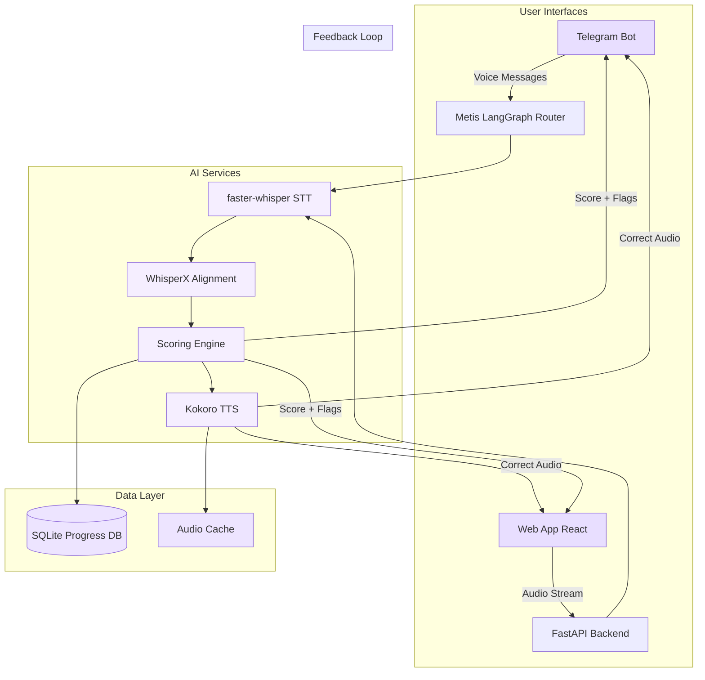
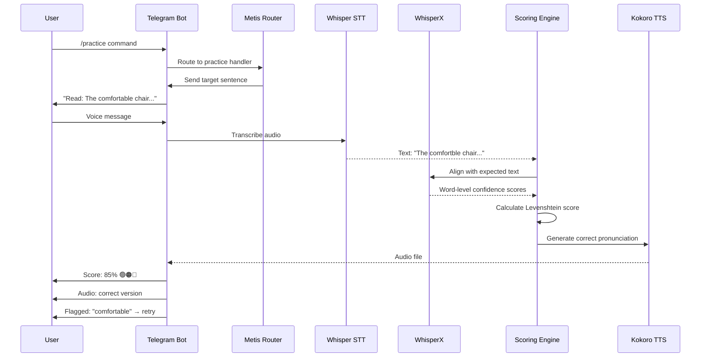
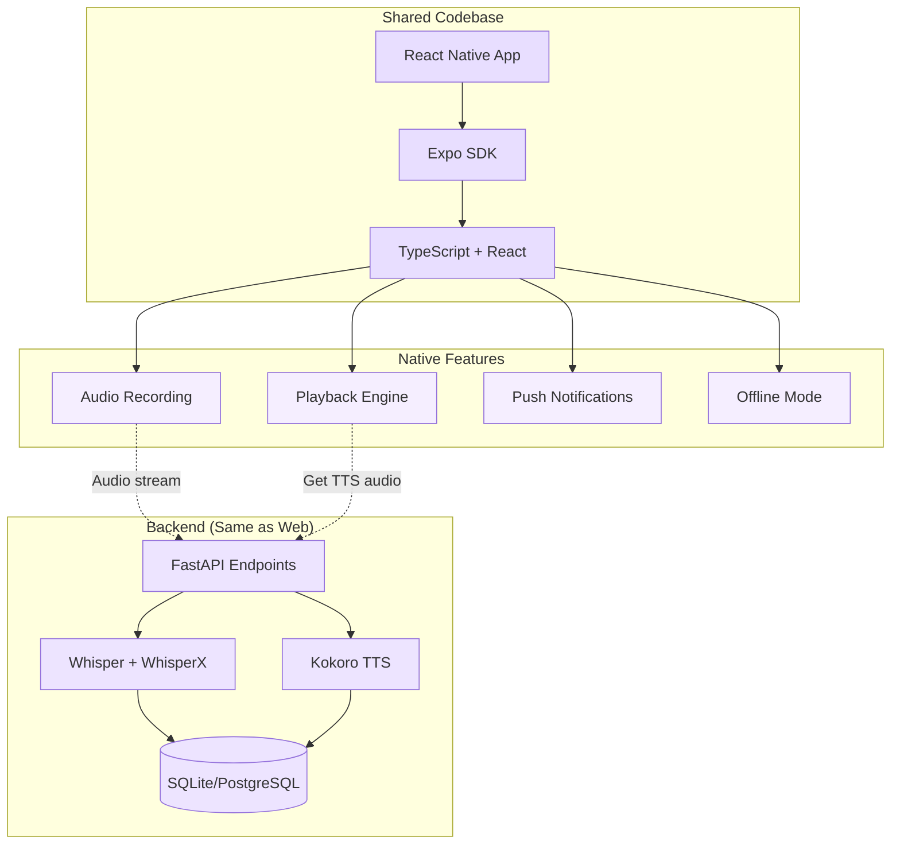
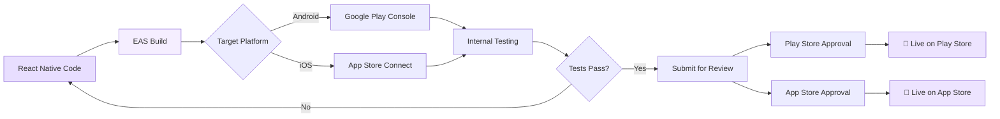
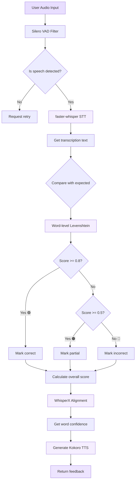
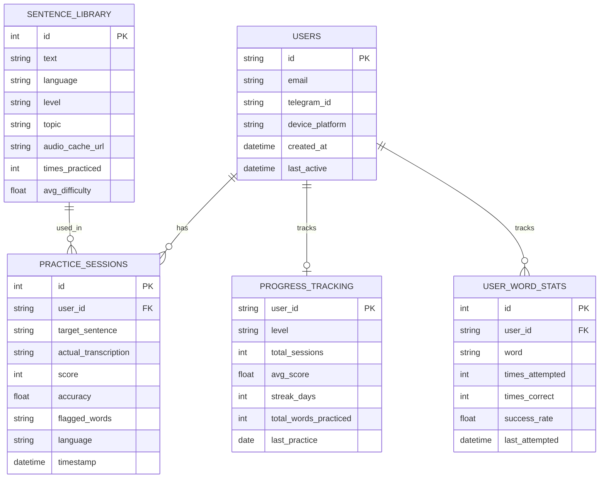
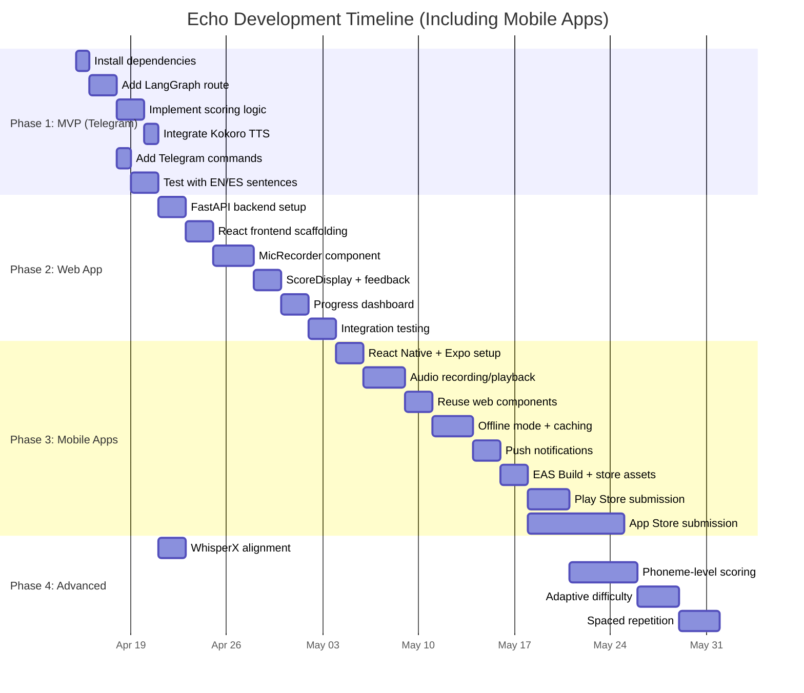
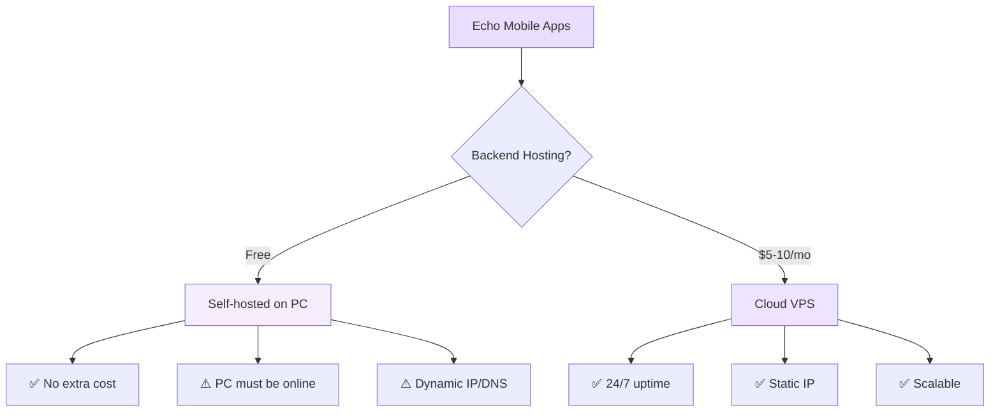

# Echo - Architecture & Implementation Plan

> Created: 2026-04-14 | Based on: ELSA Speak research + local AI stack

---

## Executive Summary

**Echo** is a pronunciation practice app that provides phoneme-level feedback using your existing local AI infrastructure. The plan recommends **Option A (Metis Telegram Skill)** as the fastest path to MVP, with a **Web App (Option B)** as the polished end goal.

---

## 1. Architecture Comparison: ELSA Speak vs Echo

| Component | ELSA Speak (Proprietary) | Echo (Local Stack) |
|-----------|-------------------------|-------------------|
| **STT Engine** | Custom speech recognition trained on 200M hours of accented speech | `faster-whisper` + WhisperX (word-level alignment) |
| **Scoring** | Proprietary phoneme-level model | Levenshtein distance + WhisperX confidence scores |
| **Feedback** | Color-coded phonemes (🟢🟠🔴) | Word-level scoring + flagged mispronunciations |
| **TTS** | Native speaker recordings | Kokoro TTS (`af_heart` EN, `ef_dora` ES) |
| **Adaptation** | AI curriculum routing | Progress tracking + difficulty scaling |

---

## 2. System Architecture Overview



### Recommended Architecture: Hybrid Approach

### Phase 1: MVP (Telegram Bot - Week 1)
**Goal: Functional pronunciation practice via Metis**

```
User → /practice → Metis sends target sentence
     → User records voice message
     → Whisper transcribes → compares to target
     → Returns: score + flagged words + Kokoro TTS audio
```

### Practice Flow Sequence



### Why Telegram first:
- ✅ Zero frontend work
- ✅ Uses existing Metis infrastructure (LangGraph routes, Telegram bot, voice message handling)
- ✅ Works on phone (Xiaoxin Pad) via Telegram app
- ✅ Test core algorithm before investing in UI

### Phase 2: Web App (React + FastAPI - Week 2-3)
**Goal: Polished UI with real-time feedback**

```mermaid
graph LR
    subgraph "Frontend React"
        A[Sentence Card] --> B[MicRecorder Component]
        B --> C[Waveform Visualizer]
        C --> D[ScoreDisplay Component]
        D --> E[ProgressChart Component]
    end
    
    subgraph "Backend FastAPI"
        F[/transcribe endpoint] --> G[Whisper Service]
        G --> H[WhisperX Alignment]
        H --> I[Scoring Engine]
        I --> J[Kokoro TTS Service]
    end
    
    B -.->|Audio blob| F
    I -.->|JSON score| D
    J -.->|Audio URL| D
    
    style A fill:#e8deff
    style B fill:#e8deff
    style C fill:#e8deff
    style D fill:#e8deff
    style E fill:#e8deff
    style F fill:#f5eeff
    style G fill:#f5eeff
    style H fill:#f5eeff
    style I fill:#f5eeff
    style J fill:#f5eeff
```

### Phase 3: Mobile Apps (Play Store + App Store - Week 4-5)
**Goal: Native mobile experience for iOS & Android**

**Recommended approach: React Native + Expo**



**Why React Native + Expo:**
- ✅ **Code reuse** - 80%+ shared code with web React frontend
- ✅ **Expo Audio API** - built-in microphone recording + playback
- ✅ **EAS Build** - cloud builds for both Play Store & App Store
- ✅ **Over-the-air updates** - fix bugs without app review
- ✅ **Your stack** - matches React/TS expertise

**App Store Deployment Pipeline:**



**Store Requirements:**

| Requirement | Google Play | Apple App Store |
|------------|-------------|-----------------|
| **Developer Account** | $25 (one-time) | $99/year |
| **Review Time** | 1-3 days | 1-7 days |
| **Privacy Policy** | Required | Required |
| **App Screenshots** | 2-8 screenshots | 6-12 screenshots |
| **Test Device** | Any Android | iPhone/iPad required |
| **Permissions** | Microphone | Microphone + Usage Description |

**Mobile-Specific Features:**
- 📱 **Offline Mode** - Cache sentence + TTS audio for practice without internet
- 🔔 **Daily Reminders** - Push notifications for streak maintenance
- 📊 **Widget Support** - Home screen widget showing daily progress
- 🎧 **Background Audio** - Listen to correct pronunciation while screen is off
- 📴 **Airplane Mode Practice** - Pre-downloaded sessions

---

### Phase 2: Web App (React + FastAPI - Week 2-3) - **CONTINUED**

```
┌─────────────────────────────────────────────────────┐
│                 Echo Web App                        │
├─────────────────┬─────────────────┬─────────────────┤
│   React Frontend│   FastAPI Backend│   AI Services   │
│                 │                 │                 │
│ • Target text   │ • /transcribe   │ • Whisper GPU   │
│ • Mic recording │ • /score        │ • WhisperX align│
│ • Color feedback│ • /tts          │ • Kokoro TTS    │
│ • Progress dash │ • /progress     │ • Silero VAD    │
└─────────────────┴─────────────────┴─────────────────┘
```

---

## 3. Core Scoring Algorithm (3-Tier)

### Scoring Decision Flow



### Tier 1: Word-Level (MVP)
```python
from Levenshtein import distance, ratio

def word_level_score(expected: str, actual: str) -> dict:
    """Compare expected vs actual transcription at word level"""
    exp_words = expected.lower().split()
    act_words = actual.lower().split()
    
    # Overall accuracy
    accuracy = ratio(expected.lower(), actual.lower())
    
    # Word-by-word matching
    flagged = []
    for i, exp_word in enumerate(exp_words):
        if i >= len(act_words):
            flagged.append({"word": exp_word, "status": "missed"})
            continue
        
        act_word = act_words[i]
        sim = ratio(exp_word, act_word)
        
        if sim >= 0.8:
            status = "correct"    # 🟢
        elif sim >= 0.5:
            status = "partial"    # 🟠
        else:
            status = "incorrect"  # 🔴
            flagged.append({"word": exp_word, "status": status, "said": act_word})
    
    return {
        "score": round(accuracy * 100),
        "flagged": flagged,
        "grade": "A" if accuracy > 0.9 else "B" if accuracy > 0.7 else "C"
    }
```

### Tier 2: WhisperX Confidence (Enhanced)
```python
import whisperx

def whisperx_alignment(audio_path: str, expected_text: str) -> dict:
    """Use WhisperX word-level timestamps + confidence for deeper scoring"""
    model = whisperx.load_model("medium", device="cuda")
    result = model.transcribe(audio_path)
    
    # Load alignment model
    align_model, metadata = whisperx.load_align_model(
        language_code=result["language"], 
        device="cuda"
    )
    aligned = whisperx.align(result["segments"], align_model, metadata)
    
    # Extract word-level confidence
    word_scores = []
    for segment in aligned["segments"]:
        for word in segment["words"]:
            word_scores.append({
                "word": word["word"],
                "confidence": word.get("score", 0.0),
                "start": word["start"],
                "end": word["end"]
            })
    
    return {
        "words": word_scores,
        "avg_confidence": sum(w["confidence"] for w in word_scores) / len(word_scores)
    }
```

### Tier 3: Phoneme-Level (Future - ELSA-grade)
```python
# Compare phoneme sequences using Dynamic Time Warping
from dtw import dtw

def phoneme_score(expected_phonemes: list, actual_phonemes: list) -> float:
    """DTW alignment of phoneme sequences for granular scoring"""
    alignment = dtw(
        expected_phonemes, 
        actual_phonemes,
        dist=lambda x, y: 0 if x == y else 1
    )
    return 1.0 - (alignment.distance / max(len(expected_phonemes), len(actual_phonemes)))
```

---

## 4. Implementation Plan

### Database Schema



### Phase 1: Metis Telegram Skill (MVP)

#### Tasks
- [ ] **1.1 Install dependencies in Metis venv**
  ```bash
  cd ~/Projects/Metis
  source .venv/bin/activate
  pip install faster-whisper whisperx python-Levenshtein silero-vad sounddevice
  ```

- [ ] **1.2 Add LangGraph route: `pronunciation_practice`**
  ```python
  # In Metis routes
  @router.route("pronunciation_practice")
  async def handle_practice(state: State):
      # 1. Get target sentence from practice list
      # 2. Wait for user voice message
      # 3. Transcribe with Whisper
      # 4. Score with Levenshtein
      # 5. Generate Kokoro TTS of correct version
      # 6. Send score + audio + feedback
  ```

- [ ] **1.3 Telegram commands**
  ```
  /practice        - Start practice session
  /sentence        - Get new target sentence
  /repeat <text>   - Practice specific sentence
  /progress        - View stats
  /level <A1|A2|B1|B2|C1> - Set difficulty
  ```

- [ ] **1.4 Practice session flow**
  ```python
  async def practice_flow(user_id: str, target_sentence: str):
      # Send target text
      await bot.send_message(user_id, f"📖 Read this:\n\n{target_sentence}")
      
      # Wait for voice message (handled by Metis voice handler)
      audio_file = await wait_for_voice_message(user_id)
      
      # Transcribe
      transcription = whisper_transcribe(audio_file)
      
      # Score
      score = word_level_score(target_sentence, transcription["text"])
      
      # Generate correct audio
      correct_audio = kokoro_tts(target_sentence, voice="af_heart")
      
      # Send feedback
      feedback = format_feedback(score, transcription["text"])
      await bot.send_message(user_id, feedback)
      await bot.send_audio(user_id, correct_audio, caption="🔊 Correct pronunciation")
      
      # Track progress
      save_score(user_id, target_sentence, score["score"])
  ```

- [ ] **1.5 Progress tracking (SQLite)**
  ```sql
  CREATE TABLE practice_sessions (
      id INTEGER PRIMARY KEY,
      user_id TEXT,
      target_sentence TEXT,
      score INTEGER,
      timestamp DATETIME DEFAULT CURRENT_TIMESTAMP,
      language TEXT DEFAULT 'en'
  );
  
  CREATE TABLE user_progress (
      user_id TEXT PRIMARY KEY,
      level TEXT DEFAULT 'A1',
      total_sessions INTEGER DEFAULT 0,
      avg_score REAL DEFAULT 0.0,
      streak_days INTEGER DEFAULT 0
  );
  ```

### Phase 2: Web App (React + FastAPI)

#### Architecture
```
Echo/
├── backend/
│   ├── main.py              # FastAPI app
│   ├── whisper_service.py   # STT + alignment
│   ├── kokoro_service.py    # TTS generation
│   ├── scoring.py           # Levenshtein + WhisperX
│   ├── database.py          # SQLite/Prisma
│   └── models.py            # Pydantic schemas
├── frontend/
│   ├── src/
│   │   ├── components/
│   │   │   ├── MicRecorder.tsx    # Browser mic recording
│   │   │   ├── ScoreDisplay.tsx   # Color-coded feedback
│   │   │   ├── SentenceCard.tsx   # Target sentence
│   │   │   └── ProgressChart.tsx  # Stats dashboard
│   │   ├── hooks/
│   │   │   └── useMicrophone.ts   # MediaRecorder API
│   │   └── pages/
│   │       ├── Practice.tsx       # Main practice UI
│   │       └── Stats.tsx          # Progress dashboard
└── shared/
    └── schema.sql
```

#### Tech Stack
| Layer | Technology |
|-------|-----------|
| **Frontend** | React + TS + Vite + Tailwind + shadcn |
| **Backend** | FastAPI + Python 3.12 |
| **STT** | `faster-whisper` + WhisperX |
| **TTS** | Kokoro (existing setup) |
| **Database** | SQLite + Prisma (reuse UIGen pattern) |
| **Audio** | Browser MediaRecorder API + Web Audio API |
| **State** | TanStack Query for server state |

---

## 5. Dependencies & Setup

### Python Dependencies
```bash
# Add to Metis venv (Phase 1) or create new Echo venv (Phase 2)
pip install \
    faster-whisper \
    whisperx \
    python-Levenshtein \
    silero-vad \
    sounddevice \
    numpy<2.0  # Required for Kokoro compatibility
```

### GPU Support (AMD RX 6700 XT)
```bash
# Whisper can use ROCm if configured
pip install faster-whisper[onnx]

# Check GPU availability
python -c "from faster_whisper import WhisperModel; model = WhisperModel('medium', device='cuda'); print('GPU works!')"
```

### System Dependencies
```bash
# espeak-ng already installed for Kokoro ✅
# Additional for audio recording
sudo apt install portaudio19-dev  # For sounddevice
```

---

## 6. Key Design Decisions

### Why Levenshtein over Phoneme-Level (Initially)?
- ✅ **Faster to implement** - word-level works today
- ✅ **Good enough for MVP** - catches most mispronunciations
- ⚠️ **Phoneme-level is harder** - requires phoneme extraction from WhisperX + IPA mapping
- 📌 **Decision**: Start with word-level, add phoneme scoring later

### Why Telegram First?
- ✅ **Zero UI work** - Telegram handles recording, playback, messaging
- ✅ **Mobile-ready** - works on Xiaoxin Pad via Telegram app
- ✅ **Leverages Metis** - uses existing bot infrastructure, voice handling, LangGraph routing
- ✅ **Fast feedback** - test algorithm with real users before building UI

### Why FastAPI for Backend (Phase 2)?
- ✅ **Your stack** - matches existing FastAPI expertise (QMANUS, Ergane)
- ✅ **Async** - handles concurrent Whisper/TTS requests
- ✅ **Pydantic** - clean API contracts
- ✅ **Easy deployment** - systemd service like Metis/Ergane

---

## 7. Risks & Mitigations

| Risk | Impact | Mitigation |
|------|--------|-----------|
| WhisperX doesn't support AMD GPU | High | Fall back to `faster-whisper` CPU mode (slower but works) |
| Kokoro TTS too slow (3-5s/sentence) | Medium | Pre-generate common sentences, cache audio |
| Telegram voice compression degrades accuracy | Medium | Use `.ogg` format, request high-quality uploads |
| Levenshtein too coarse for subtle errors | Low | Add WhisperX confidence scores as secondary metric |
| Browser mic recording compatibility | Medium | Use `MediaRecorder` with fallback to `Recorder.js` |

---

## 7. Implementation Timeline



### Timeline Breakdown

---

## 8. Costs & Budget

### Development Costs
| Item | Cost | Notes |
|------|------|-------|
| **Google Play Developer Account** | $25 | One-time fee |
| **Apple Developer Program** | $99/year | Required for App Store |
| **EAS Build (Expo)** | Free tier | 30 builds/month, upgrade to $29/mo if needed |
| **Backend Hosting** | $0 (self-hosted) | Running on your PC, or $5-10/mo on VPS |
| **Domain + SSL** | $12/year | For API endpoint (echo.positronica.dev?) |
| **Total Year 1** | **~$136** | + hosting if not self-hosted |

### Infrastructure Options



**Recommendation:** Start with self-hosted (your PC with ngrok/tailscale for testing), move to VPS ($5 DigitalOcean droplet or AWS EC2 t4g.micro free tier) before Play Store submission.

---

## 9. Success Metrics

- ✅ User can complete a practice session (read → record → get feedback)
- ✅ Score accuracy correlates with actual pronunciation quality
- ✅ System flags mispronounced words correctly (>80% precision)
- ✅ Kokoro TTS audio plays correct pronunciation
- ✅ Progress tracking shows improvement over time
- ✅ App approved by Google Play & Apple App Store
- ✅ Users complete 5+ practice sessions per week

---

## 10. Next Actions

1. **✅ Review architecture plan** - Decide on phases and priorities
2. **🔲 Start Phase 1 (Telegram MVP)** - Install dependencies in Metis venv
3. **🔲 Create LangGraph route** for pronunciation practice
4. **🔲 Implement word-level scoring** with Levenshtein
5. **🔲 Test with 10 sentences** (EN + ES)
6. **🔲 Register developer accounts** - Google Play ($25) + Apple ($99/year)
7. **🔲 Gather feedback** → iterate → build web app → mobile apps

---

## Appendix: Reference Links

- **ELSA Speak Research**: https://skywork.ai/skypage/en/ELSA-Speak-in-2025-An-AI-User's-Deep-Dive-into-the-Ultimate-Pronunciation-Coach/1974387185089703936
- **WhisperX GitHub**: https://github.com/m-bain/whisperX
- **faster-whisper**: https://github.com/SYSTRAN/faster-whisper
- **Kokoro TTS**: Already installed in `~/Tools/tts-tools/`
- **Levenshtein Python**: https://pypi.org/python-Levenshtein/
- **Silero VAD**: https://github.com/snakers4/silero-vad
- **React Native + Expo**: https://expo.dev/
- **EAS Build**: https://docs.expo.dev/build/introduction/
- **Google Play Console**: https://play.google.com/console/
- **App Store Connect**: https://appstoreconnect.apple.com/

---

## Appendix: Stitch UI Design

**Project**: [Echo - Pronunciation Practice App](https://stitch.withgoogle.com/projects/3633717535729093290)

- **Design System**: "Editorial Fluency" - Sophisticated softness with indigo tones
- **Typography**: Plus Jakarta Sans (headlines) + Be Vietnam Pro (body)
- **Colors**: Indigo primary (`#4F46E5`), purple-tinted surfaces
- **Style**: No-line rule, glassmorphism overlays, gradient CTAs
- **Screens**: Practice session UI with color-coded word feedback
