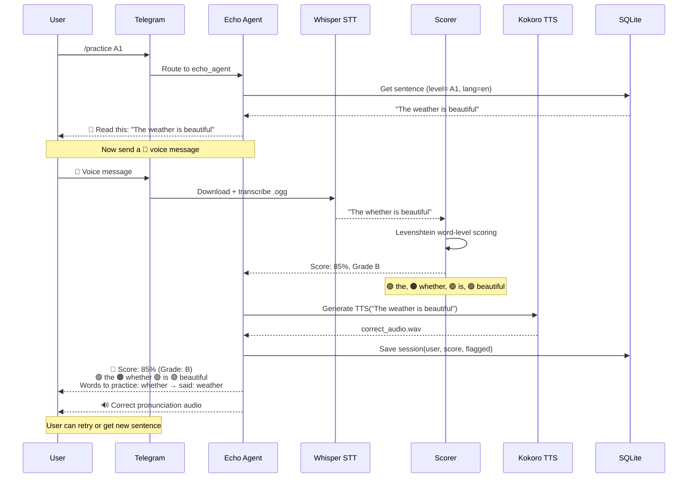
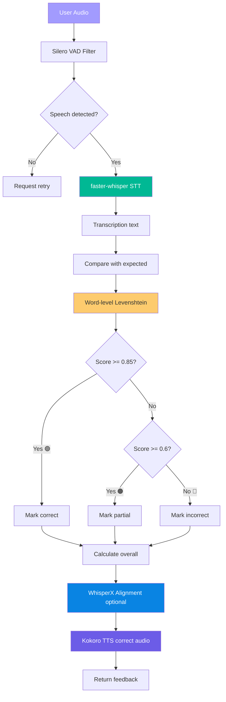
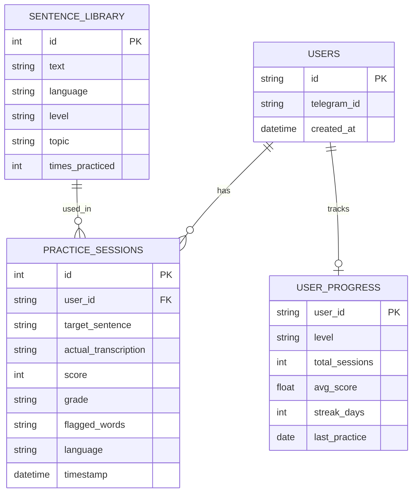
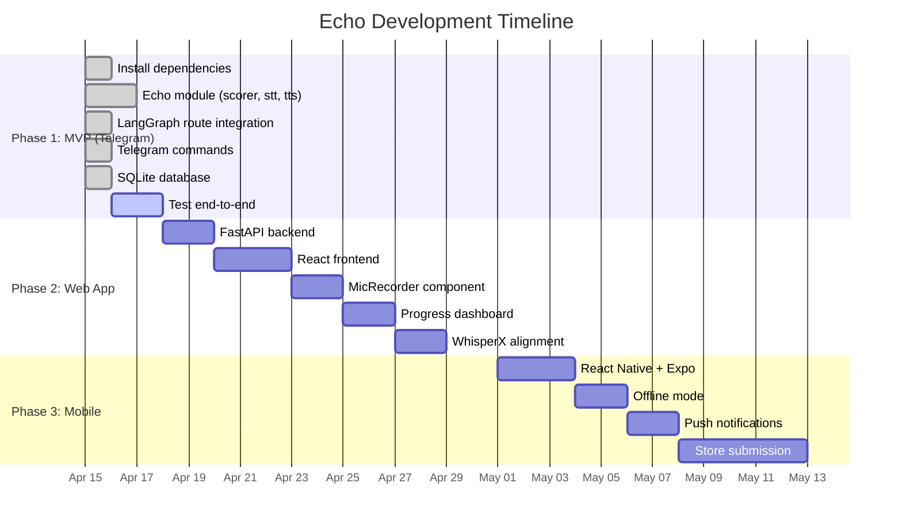

# 🎤 Echo — Pronunciation Practice App

> AI-powered pronunciation coaching using local Whisper STT + Kokoro TTS.

[](LICENSE)
[](Echo_Architecture_Plan.md)

## Overview

Echo provides **phoneme-level pronunciation feedback** using your local AI stack. Start with Telegram MVP, scale to React web app, then mobile apps.

```mermaid
graph TB
    subgraph "Phase 1: MVP (Telegram)"
        TG[Telegram Bot] --> PRACTICE[/practice command/]
        PRACTICE --> TARGET[Send Target Sentence]
        TARGET --> VOICE[User Voice Message]
        VOICE --> WHISPER[Whisper STT]
        WHISPER --> SCORE[Levenshtein Scoring]
        SCORE --> TTS[Kokoro TTS]
        SCORE --> FEEDBACK[🟢🟠🔴 Feedback]
        TTS --> AUDIO[Correct Pronunciation Audio]
        SCORE --> DB[(SQLite Progress)]
    end

    subgraph "Phase 2: Web App"
        REACT[React Frontend] --> MIC[MicRecorder Component]
        MIC --> API[FastAPI /transcribe]
        API --> WHISPER2[Whisper + WhisperX]
        WHISPER2 --> ALIGN[Word Alignment]
        ALIGN --> SCORE2[Confidence Scoring]
        SCORE2 --> DASH[Progress Dashboard]
    end

    subgraph "Phase 3: Mobile"
        RN[React Native + Expo] --> AUDIO_REC[Audio Recording]
        AUDIO_REC --> API2[Same FastAPI Backend]
        API2 --> OFFLINE[Offline Mode]
        OFFLINE --> PUSH[Push Notifications]
        PUSH --> STORES[Play Store + App Store]
    end

    style TG fill:#a29bfe,color:#fff
    style REACT fill:#0984e3,color:#fff
    style RN fill:#00b894,color:#fff
```



## Architecture Comparison

| Component | ELSA Speak | Echo (Local Stack) |
|-----------|-----------|-------------------|
| **STT** | Custom (200M hours accented speech) | `faster-whisper` + WhisperX |
| **Scoring** | Proprietary phoneme model | Levenshtein distance + confidence |
| **Feedback** | Color-coded phonemes 🟢🟠🔴 | Word-level scoring + flagged words |
| **TTS** | Native speaker recordings | Kokoro TTS (`af_heart` EN, `ef_dora` ES) |
| **Platform** | Mobile apps | Telegram → Web → React Native |

## Practice Flow



## Scoring Algorithm (3-Tier)



### Tier 1: Word-Level (MVP) ✅ Implemented

```python
from src.echo import EchoScorer

scorer = EchoScorer()
result = scorer.score(
    expected="The comfortable chair was near the door",
    actual="The comfortble chair was near the door"
)

# Returns:
# {
#   "overall_score": 98,
#   "grade": "A",
#   "words": [
#     {"word": "the", "status": "correct", "said": "the"},
#     {"word": "comfortable", "status": "partial", "said": "comfortble"},
#     ...
#   ],
#   "flagged": [{"word": "comfortable", "status": "partial", "said": "comfortble"}]
# }
```

### Tier 2: WhisperX Confidence (Phase 2)

Uses WhisperX word-level timestamps + confidence scores for deeper analysis.

### Tier 3: Phoneme-Level (Future)

DTW alignment of phoneme sequences for ELSA-grade granularity.

## Database Schema



## Timeline



## Quick Start (MVP)

### Prerequisites

- Metis bot running
- Ollama with models loaded
- Telegram app

### Usage

1. **Start practice**:
   ```
   /practice              # Get A1 English sentence
   /practice A2 spanish   # Get A2 Spanish sentence
   /practice: Your text   # Practice custom sentence
   ```

2. **Read aloud** the target sentence

3. **Send voice message** in Telegram

4. **Get feedback** with score + correct pronunciation audio

5. **Check progress**:
   ```
   /progress              # View your stats
   ```

## Project Structure

```
Echo/
├── Echo_Architecture_Plan.md    # Full architecture plan
├── Echo.md                       # Project notes
└── .qwen/                        # AI assistant config

Metis/src/echo/                   # Implementation lives here
├── __init__.py
├── scorer.py                     # Levenshtein scoring engine
├── stt.py                        # Whisper STT wrapper
├── tts.py                        # Kokoro TTS integration
└── database.py                   # SQLite progress tracking
```

## Tech Stack

| Layer | Technology |
|-------|-----------|
| **STT** | `faster-whisper` (medium model) |
| **Scoring** | `python-Levenshtein` |
| **TTS** | Kokoro (`af_heart` EN, `ef_dora` ES) |
| **VAD** | Silero VAD (noise filtering) |
| **Database** | SQLite |
| **Platform** | Telegram → React → React Native |
| **GPU** | AMD RX 6700 XT (ROCm) |

## Costs

| Item | Cost |
|------|------|
| Google Play Developer | $25 (one-time) |
| Apple Developer Program | $99/year |
| Backend Hosting | $0 (self-hosted) or $5/mo VPS |
| **Total Year 1** | **~$136** |

## Success Metrics

- ✅ User completes practice session (read → record → feedback)
- ✅ Score correlates with actual pronunciation quality
- ✅ System flags mispronounced words (>80% precision)
- ✅ Progress tracking shows improvement over time
- ✅ Users complete 5+ sessions per week

## Roadmap

- [x] Phase 1: Telegram MVP ✅ **Complete**
- [x] Phase 2: React Web App ✅ **Implementation Complete** (Ready for testing)
- [ ] Phase 3: React Native Mobile Apps
- [ ] Phase 4: WhisperX alignment + phoneme-level scoring
- [ ] Phase 5: Spaced repetition + adaptive difficulty

## Quick Start (Phase 2 - Web App)

### Backend
```bash
cd backend
pip install -r requirements.txt
python main.py  # http://localhost:8000
```

### Frontend
```bash
cd frontend
npm install
npm run dev  # http://localhost:5173
```

📖 **Full docs**: See `PHASE2_IMPLEMENTATION.md`

## License

MIT License

## Acknowledgments

- [ELSA Speak](https://elsaspeak.com/) for inspiration
- [faster-whisper](https://github.com/SYSTRAN/faster-whisper)
- [Kokoro TTS](https://github.com/hexgrad/kokoro)
- [Metis](https://github.com/G10hdz/Metis) for infrastructure
